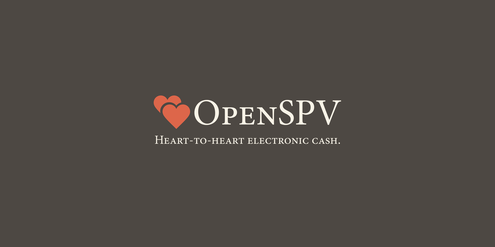

# OpenSPV

## Introduction

OpenSPV is a full-stack multi-platform scalable MIT-licensed open-source
open-protocol white-label Bitcoin wallet for individuals and businesses. It is
an implementation Simplified Payment Verification (SPV) described by Craig
Wright (Satoshi Nakamoto) in the original [Bitcoin white
paper](https://craigwright.net/bitcoin-white-paper.pdf).

Bitcoin solved the problem of peer-to-peer electronic cash and can be used to
make public key infrastructure (PKI) more secure by publicly logging signing and
revocation. We can use these ideas to design and develop new protocols for
identity that leverage and enhance Bitcoin and the Internet.

[Paymail](https://bsvalias.org/) is used as the first element of a protocol
suite to solve identity. 

## The Standards Agenda

We are designing and developing a new protocol suite called the [Social Bitcoin
Web](https://www.ryanxcharles.com) which extends paymail with new protocols for
identity, authentication, authority and permissions, tokens, and media objects
to connect Social, Bitcoin, and the Web together to enable a true market of
information. The new protocols will be standardized by the [Technical Standards
Committee](https://tsc.bitcoinassociation.net/).

We need to start by getting SPV working which requires collaboration of wallet
entities. The first step is to make P2P transactions work, which has already
been accomplished, but is not in widespread use yet. The next step is to deliver
Merkle proofs with the transactions. [The full standards agenda was described in
2020 by founder Ryan X. Charles in this article on
PowPing](https://powping.com/posts/ef72d7cb5e0ce6a7457dffc79f9c17e791cc50d18f049d5e89736c624d805a04).

## The Company

OpenSPV is the core technology of [Coasian](https://www.coasian.com)
([GitHub](https://github.com/coasian)) and is being used inside new advanced
applications enabled by peer-to-peer electronic cash.

Copyright (c) 2021 Coasian Inc.

This is test changes, don't commit.
